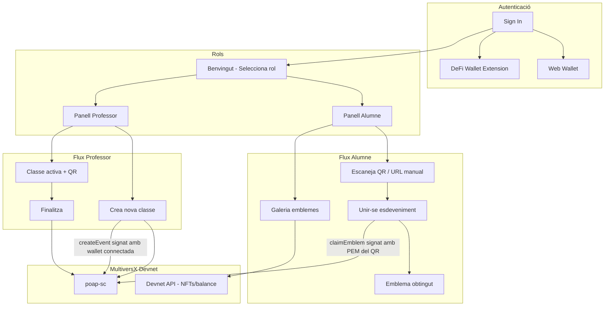

# Pla: POAP dApp MultiversX

## Context i decisions


| Element              | Estat                                                                                                                                                     |
| -------------------- | --------------------------------------------------------------------------------------------------------------------------------------------------------- |
| Smart contract       | Fet a `[poap-sc/](poap-sc/)` — desplegat a Devnet                                                                                                         |
| Frontend             | **No existeix encara** al repo (la plantilla `mx-defi-tutorial-dapp` no hi és; es crearà des de zero)                                                     |
| Plantilla recomanada | `[mx-template-dapp-reactjs](https://github.com/multiversx/mx-template-dapp-reactjs)` — React + Vite + `@multiversx/sdk-dapp` v5 + React Router + Tailwind |
| xarxa                | Devnet (adreces a `[smart_contract.md](smart_contract.md)`)                                                                                               |
| Reclamació           | PEM del professor inclosa al QR/URL (confirmat per tu)                                                                                                    |


**Contracte desplegat (Devnet):**

- SC: `erd1qqqqqqqqqqqqqpgq5prfr0ynhtsgu5x885hddsfdz2zcz00pmkasp9cmd6`
- Col·lecció SFT: `POAP-042a5d`

**Endpoints rellevants del contracte:**

```71:123:poap-sc/src/endpoints.rs
#[endpoint(createEvent)]
fn create_event(&self, name, url, end_date, max_participants) { ... }

#[endpoint(claimEmblem)]
fn claim_emblem(&self, recipient: ManagedAddress) {
    let organizer = self.organizer(); // caller = professor
    ...
}
```

---

## Arquitectura




---

## Estructura del projecte

Crear carpeta `[poap-dapp/](poap-dapp/)` al repo (monorepo amb `poap-sc/`):

```
poap-dapp/
├── src/
│   ├── config/           # devnet, SC address, token ID, URLs faucet
│   ├── contracts/        # ABI + helpers createEvent/claim/finalize/query
│   ├── hooks/            # useActiveEvent, useAccountNfts, useOrganizerPem
│   ├── pages/
│   │   ├── LoginPage.jsx
│   │   ├── WalletGuidePage.jsx
│   │   ├── RoleSelectPage.jsx
│   │   ├── student/      # StudentHome, ClaimPage, EmblemObtained
│   │   └── teacher/      # TeacherHome, QrPage, FundsGuidePage
│   ├── components/       # Layout, Button, EmblemGrid, QrScanner, QrDisplay
│   ├── routes/
│   └── styles/           # tema coral mòbil-first
├── public/emblems/       # imatges predefinides per seleccionar
└── vite.config.js        # base path per GitHub Pages
```

Eliminar la plantilla `mx-defi-tutorial-dapp` si existeix fora del repo; dins del repo no cal res.

---

## Fase 1: Bootstrap i configuració

1. Clonar l'estructura de `[mx-template-dapp-reactjs](https://github.com/multiversx/mx-template-dapp-reactjs)` a `poap-dapp/`.
2. Configurar `initApp` a `[main.jsx](poap-dapp/src/main.jsx)`:
  - `environment: EnvironmentsEnum.devnet`
  - `storage: sessionStorage`
3. **Login només Web Wallet + DeFi Wallet**: botons personalitzats amb `ProviderFactory.create({ type: ProviderTypeEnum.wallet })` i `ProviderTypeEnum.extension` — sense `UnlockPanelManager` genèric (evita xPortal, Ledger, Passkeys, etc.).
4. Copiar ABI des de `[poap-sc/output/poap-sc.abi.json](poap-sc/output/poap-sc.abi.json)` i generar helpers de transacció amb `@multiversx/sdk-core` + `SmartContractTransactionsFactory`.
5. Variables a `[config.devnet.js](poap-dapp/src/config/config.devnet.js)`:
  - `SC_ADDRESS`, `TOKEN_ID`, `MIN_EGLD = 0.1`, `FAUCET_URL`, `WALLET_GUIDE_URL`

---

## Fase 2: Rutes i fluxos (segons mockups + disseny tècnic)


| Ruta               | Pantalla             | Notes                                                  |
| ------------------ | -------------------- | ------------------------------------------------------ |
| `/`                | Sign In              | Web Wallet / DeFi Wallet + enllaç "Crea un Wallet nou" |
| `/guia/wallet`     | Guia crear wallet    | Enllaç MultiversX + botó "Fet, torna al Login"         |
| `/rol`             | Benvingut            | Alumne / Professor (només si obertura manual)          |
| `/alumne`          | Panell alumne        | Escaneja QR, URL manual, galeria                       |
| `/alumne/reclamar` | Unir-se esdeveniment | Params: `?o=<organizer>&k=<pem_b64>`                   |
| `/alumne/emblema`  | Emblema obtingut     | Detalls post-claim                                     |
| `/professor`       | Panell professor     | Classe activa O formulari crear                        |
| `/professor/qr`    | Mostra QR            | QR amb URL de reclamació                               |
| `/guia/fons`       | Guia reclamar fons   | Faucet xEGLD                                           |


**Routing intel·ligent post-login** (del disseny tècnic):

- Si URL conté params de claim (`o`, `k`) → login com a alumne → `/alumne/reclamar`
- Si obertura manual → `/rol`

**Guards**: rutes protegides requereixen wallet connectada (`useGetLoginInfo`); logout torna a `/`.

---

## Fase 3: Integració contracte

### Professor — `createEvent`

- Signat amb wallet connectada (Web/DeFi) via `TransactionManager`.
- Args: `name`, `url` (URL d'imatge seleccionada), `end_date` (ms), `max_participants`.
- Validacions UI: data futura, límit > 0, PEM vàlid, adreça PEM = adreça connectada (o avís si difereix).
- Abans d'enviar: comprovar balance ≥ 0.1 xEGLD via Devnet API; si no → `/guia/fons`.
- Després d'èxit: guardar PEM a `sessionStorage` (`poap:organizerPem`) per generar QR.

### Professor — esdeveniment actiu

- Query `getActiveEvent(organizerAddress)` en carregar panell.
- Mostrar: nom, dates, participants `current/max`, imatge, botons QR i Finalitza.
- Poll cada ~30s per actualitzar comptador de participants.
- `finalizeEvent` signat amb wallet connectada.

### QR de classe

- URL: `{origin}/alumne/reclamar?o={organizer}&k={base64(pem)}`
- Generar amb `qrcode.react`; opció descarregar PNG (canvas → blob).
- **Nota de seguretat visible al professor**: la clau viatja al QR (acceptable en entorn didàctic).

### Alumne — reclamació

1. Login amb wallet → obtenir `recipientAddress`.
2. Llegir PEM del param `k`; crear `UserSigner` amb `@multiversx/sdk-wallet`.
3. Construir tx `claimEmblem(recipient)` signada amb PEM (organizer = sender).
4. Enviar via gateway; esperar confirmació.
5. Query `hasClaimed` + `getActiveEvent` per mostrar pantalla "Emblema obtingut!".

### Alumne — galeria

- `GET https://devnet-api.multiversx.com/accounts/{address}/nfts?collections=POAP-042a5d`
- Grid scrollable: imatge (`media[0].url`), nom NFT, data (metadata o timestamp).

### Escaneig QR

- Llibreria `html5-qrcode` o `@yudiel/react-qr-scanner` (HTTPS obligatori per càmera).
- Validar que la URL escanejada pertany al domini de l'app i conté params vàlids.

---

## Fase 4: UI (mockups)

- **Mobile-first**, max-width ~430px centrat, fons blanc, text gris fosc.
- Botons primaris coral/vermell (`#E85D5D` aprox.), botons secundaris gris.
- Header reutilitzable: icona + "Company Name" (configurable).
- Textos en **català** segons mockups.
- Imatges d'emblemes: selector amb 4–6 PNG a `public/emblems/` + opció URL externa (segons disseny tècnic).
- Pantalles guia (wallet / fons): llista scrollable amb placeholders com als mockups.

---

## Fase 5: Desplegament GitHub Pages

1. `vite.config.js`: `base: '/poap/'` (o nom del repo).
2. Script `build-devnet` + GitHub Action workflow `.github/workflows/deploy-pages.yml`:
  - `yarn build-devnet` → artifact → GitHub Pages.
3. Documentar al README com obtenir xEGLD del faucet Devnet.

---

## Dependències clau


| Paquet                   | Ús                          |
| ------------------------ | --------------------------- |
| `@multiversx/sdk-dapp`   | Login Web/DeFi, tx tracking |
| `@multiversx/sdk-core`   | Construcció transaccions SC |
| `@multiversx/sdk-wallet` | Signar claims amb PEM       |
| `react-router-dom`       | Navegació                   |
| `qrcode.react`           | Generar QR professor        |
| `html5-qrcode`           | Escanejar QR alumne         |
| `axios`                  | Devnet API (NFTs, balance)  |


---

## Riscos i limitacions conegudes

- **PEM al QR**: qualsevol amb el QR pot signar claims fins esgotar participants o finalitzar esdeveniment — coherents amb el model didàctic del disseny tècnic.
- **HTTPS obligatori**: DeFi Wallet i càmera QR requereixen HTTPS (GitHub Pages ho proporciona; dev local amb `@vitejs/plugin-basic-ssl`).
- **QR llarg**: PEM en base64 fa QR densos; es pot usar compressió o PEM curt (24 words → JSON wallet) si cal.
- **Contracte fix**: no es modifica `poap-sc`; el flux s'adapta al disseny actual del contracte.

---

## Ordre d'implementació recomanat

1. Bootstrap `poap-dapp` + config Devnet + login dual (Web/DeFi)
2. Rutes base + layout UI català
3. Helpers contracte + panell professor (create + active + finalize)
4. QR generation + flux alumne (claim amb PEM)
5. Galeria NFTs + escaneig QR
6. Guies (wallet/fons) + GitHub Pages deploy